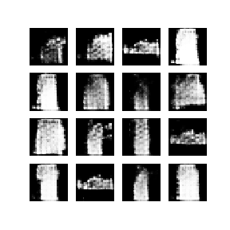

# Deep Convolutional Generative Adversarial Networks 

### Trained on Fashion_MNIST dataset using Keras Sequential API and Tensorflow gradient tape training loop

Generative Adversarial Networks have two components:

 A <strong> Generator </strong> and <strong> Discriminator </strong> which are trained simultaneosuly using adversarial crafting process. 

 A <strong>Generator</strong> network : It behaves as an artist trying to generate images without any knowledge about the true and learns by interacting with the <strong>Discriminator</strong>. 

 A <strong>Discriminator</strong> netowrk : It behaves as an art critic trying to determine whether a given image is real or fake. It uses the output of generator as training data 

### Generator images Animation : 

The training for generator began by giving input as some random noise and after 60 epochs it starts to generate images that resemble images from the Fashion MNIST dataset.

